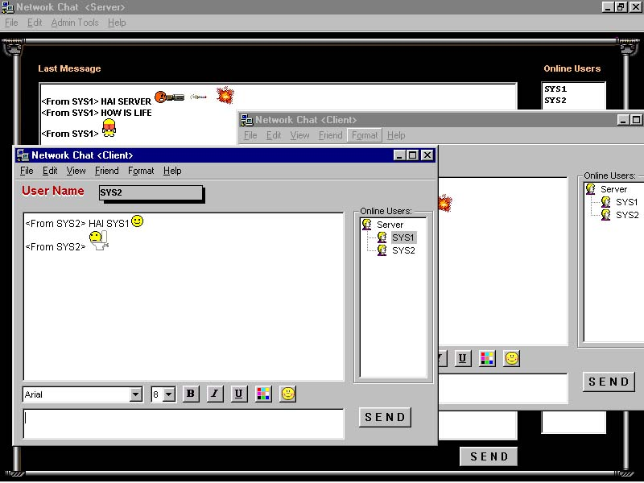



## NetChat2002

### Description

Network Chat is a multi-user chat application that can be run across a network or the intranet. With remote computer access.
 
### More Info
 

             |
---                |---
**Submitted On**   |2002-03-21 16:52:52
**By**             |[jayanth kumar](https://github.com/Planet-Source-Code/PSCIndex/blob/master/ByAuthor/jayanth-kumar.md)
**Level**          |Advanced
**User Rating**    |4.0 (20 globes from 5 users)
**Compatibility**  |VB 6\.0
**Category**       |[Internet/ HTML](https://github.com/Planet-Source-Code/PSCIndex/blob/master/ByCategory/internet-html__1-34.md)
**World**          |[Visual Basic](https://github.com/Planet-Source-Code/PSCIndex/blob/master/ByWorld/visual-basic.md)
**Archive File**   |[NetChat200644603222002\.zip](https://github.com/Planet-Source-Code/jayanth-kumar-netchat2002__1-32949/archive/master.zip)

